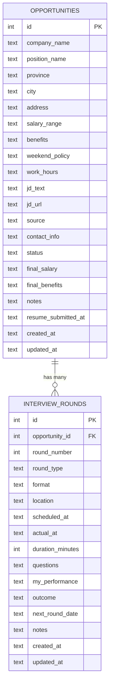

# 数据模型

两张表 + 一个索引。所有定义在 [`backend/src/db.ts`](../backend/src/db.ts)。

## 实体关系



## opportunities（机会）

存"我投了哪家公司"。

| 字段 | 类型 | 必填 | 默认 | 说明 |
|---|---|---|---|---|
| `id` | INTEGER PK AUTOINCREMENT | 是 | - | 主键 |
| `company_name` | TEXT | 是 | - | 公司名 |
| `position_name` | TEXT | 是 | - | 岗位名 |
| `province` | TEXT | 否 | NULL | 省（v0.4.0 新增） |
| `city` | TEXT | 否 | NULL | 市/区，存完整字符串如"广州市南沙区" |
| `address` | TEXT | 否 | NULL | 详细地址 |
| `salary_range` | TEXT | 否 | NULL | 自由文本，如 `15K-20K*13` |
| `benefits` | TEXT | 否 | NULL | 自由文本 |
| `weekend_policy` | TEXT | 否 | NULL | enum: `double_off` / `single_off` / `alternating` / `compensatory` / `unknown` |
| `work_hours` | TEXT | 否 | NULL | 如 `9:00-18:00` |
| `jd_text` | TEXT | 否 | NULL | JD 全文 |
| `jd_url` | TEXT | 否 | NULL | JD 链接 |
| `source` | TEXT | 否 | NULL | 来源（Boss / 内推 / 拉勾 / 猎聘 / 脉脉 / 自定义） |
| `contact_info` | TEXT | 否 | NULL | HR 联系人 |
| `status` | TEXT | 是 | `in_progress` | 8 状态之一，详见下文 |
| `final_salary` | TEXT | 否 | NULL | 收到的 offer 薪资 |
| `final_benefits` | TEXT | 否 | NULL | 收到的 offer 福利 |
| `notes` | TEXT | 否 | NULL | 备注 |
| `resume_submitted_at` | TEXT | 否 | NULL | 简历提交时间（v0.9.0 新增），ISO 8601，Action Items 用 |
| `created_at` | TEXT | 是 | `datetime('now')` | 创建时间 |
| `updated_at` | TEXT | 是 | `datetime('now')` | 更新时间 |

### 状态字段 enum

8 个值，对应中文招聘流程里的真实阶段：

| 值 | 中文 | 含义 |
|---|---|---|
| `in_progress` | 进行中 | 已有面试轮次排上 |
| `awaiting_response` | 等待回复 | 简历已投，等 HR 排面（v0.9.0 新增） |
| `offered` | 已 Offer | 收到 offer |
| `accepted` | 已接受 | 签了 offer |
| `rejected` | 未通过 | 面试没过 / HR 默拒 |
| `withdrawn` | 我已撤回 | 主动放弃 |
| `declined` | 已拒 offer | 拿到 offer 后拒绝 |
| `accepted_then_left` | 入职后离职 | 干了一阵走了 |

后端 `validate.ts` 强制 enum，前端 `STATUS_META` 提供中文标签 + 配色。

## interview_rounds（面试轮次）

存"这家公司的每一轮面试"。

| 字段 | 类型 | 必填 | 默认 | 说明 |
|---|---|---|---|---|
| `id` | INTEGER PK AUTOINCREMENT | 是 | - | 主键 |
| `opportunity_id` | INTEGER | 是 | - | 外键 → `opportunities.id`，ON DELETE CASCADE |
| `round_number` | INTEGER | 是 | - | 1 = 一面，2 = 二面... |
| `round_type` | TEXT | 是 | - | enum: `hr_screen` / `tech_1` / `tech_2` / `tech_3` / `comprehensive` / `final` / `salary_negotiation` / `other` |
| `format` | TEXT | 是 | - | enum: `online_video` / `onsite` / `phone` |
| `location` | TEXT | 否 | NULL | 地点 |
| `scheduled_at` | TEXT | 是 | - | 计划时间，ISO 8601 |
| `actual_at` | TEXT | 否 | NULL | 实际时间（面试完后补录） |
| `duration_minutes` | INTEGER | 否 | NULL | 实际面试时长（分钟） |
| `questions` | TEXT | 否 | NULL | 面试问题 |
| `my_performance` | TEXT | 否 | NULL | 自我评价 |
| `outcome` | TEXT | 是 | `pending` | enum: `pending` / `passed` / `failed` / `cancelled` |
| `next_round_date` | TEXT | 否 | NULL | 下一轮大致时间（HR 通知时填） |
| `notes` | TEXT | 否 | NULL | 备注 |
| `created_at` | TEXT | 是 | `datetime('now')` | - |
| `updated_at` | TEXT | 是 | `datetime('now')` | - |

### outcome 状态机

```
pending ─┬─→ passed  (轮次通过)
         ├─→ failed  (轮次未通过)
         └─→ cancelled (取消 / 鸽)
```

`passed` / `failed` / `cancelled` 都是终态，触发后该 round 不再出现在 Action Items 的 pending_overdue 提醒里。

## 索引

```sql
CREATE INDEX IF NOT EXISTS idx_rounds_opportunity
  ON interview_rounds(opportunity_id);
```

只这一个索引，按 `opportunity_id` 查轮次用。

## 迁移历史

`db.ts` 的 `initDb()` 启动时跑以下一次性迁移（idempotent，可反复执行）：

| 版本 | 迁移 | 备份情况 |
|---|---|---|
| 初始 | CREATE TABLE 两张表 + 索引 | - |
| v0.4.0 | ADD COLUMN `province TEXT` | 老行 province = NULL |
| v0.9.0 | ADD COLUMN `resume_submitted_at TEXT` | 老行 = NULL（Action Items 用 created_at fallback） |
| v0.4.0 | `has_weekends_off` (INT 0/1) → `weekend_policy` (TEXT enum) | 0 → NULL, 1 → 'double_off'；SQLite ≥ 3.35 自动 DROP COLUMN 老列 |

迁移在 `PRAGMA table_info(opportunities)` 检查列名，**已迁移过的不会重复加**。加新列的统一模式：

```ts
const cols = instance
  .prepare("PRAGMA table_info(opportunities)")
  .all() as Array<{ name: string }>;

if (!cols.some((c) => c.name === 'new_column')) {
  instance.exec(`ALTER TABLE opportunities ADD COLUMN new_column TYPE`);
}
```

## 时间格式

所有时间字段都是 ISO 8601 字符串（SQLite TEXT），不是整数时间戳：

```
2026-08-31 14:30:00         -- 来自 SQLite datetime('now')
2026-09-01T15:00:00         -- 来自前端 DateTimeInput
2026-08-31T14:30:00.000Z    -- 来自 fetch 后端再转
```

前端的 `lib/format.ts` 统一处理显示；后端用 `parseISO` 解析；不混用 Date 对象直接传 DB。
